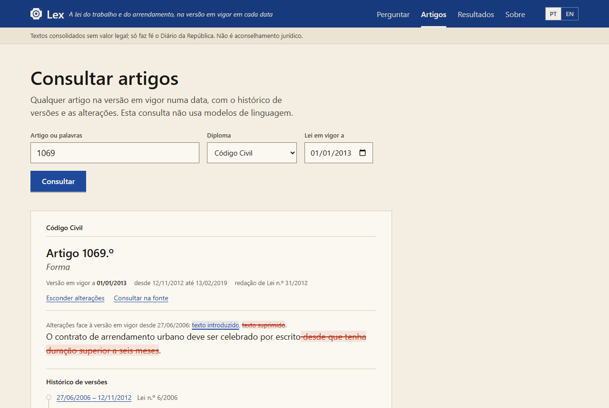
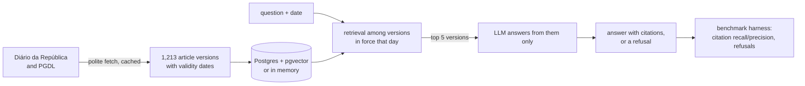

# Lex

An open benchmark for question answering over Portuguese legislation, and an open-source system
measured against it. **Live demo: [lex-beryl.vercel.app](https://lex-beryl.vercel.app)**
(Portuguese or English interface). Code: [github.com/timimata/lex](https://github.com/timimata/lex);
dataset (dev split): [huggingface.co/datasets/timimata/lex](https://huggingface.co/datasets/timimata/lex).

Portugal already has AI assistants for its law: Lia on the Diário da República, the Ministry of
Justice's Guia Prático, and commercial tools such as TogaAI and LeiGPT. As far as we could find,
none of them publishes how often it is right. Lex is about that question. It is a set of real
questions in European Portuguese, each with the date it is asked about and the articles a correct
answer must cite, plus a reference system whose every number comes from running it.


## What it does

- **The law on any date.** Labour and tenancy law: every article of the Código do Trabalho in
  every version since 2009, and, on tenancy, the Código Civil's articles on leases (1022.º to
  1113.º) and the NRAU in every version since 2006, with the dates each was in force, checked
  against the Diário da República's own history. Ask about 1 June 2011 and the answer uses the
  2011 text.
- **Answers that cite, or refuse.** A language model answers only from the articles retrieved for
  that date, with a citation after every sentence; a citation of an article it was not given is
  dropped, a sentence left without one is dropped, and an answer left with none becomes a
  refusal.
- **What changed.** Any cited article opens on its version for the date, with its timeline and the
  changes from the previous version marked paragraph by paragraph.
- **Measured, not claimed.** A 201-question benchmark with a held-out test split, and every number
  below comes from `results/`.




## Results

<!-- results: written by python -m lex.eval report --write; edit the code, not this block -->
On the held-out test split of benchmark v4 (96 questions never used to tune anything, 76 answerable and 20 not; `results/test/`):

| Retrieval | recall@1 | recall@10 | questions naming their article, ranked first |
|---|---|---|---|
| BM25 | 0.52 | 0.76 | 0 of 8 |
| Dense (BGE-M3) | 0.56 | 0.81 | 0 of 8 |
| Dense + reranker + reference parser (reference system) | 0.75 | 0.94 | 8 of 8 |
| Gemini Embedding 2 + reference parser (the demo) | 0.81 | 1.00 | 8 of 8 |

| Answers (top 5 articles, Gemini 3.1 Flash-Lite) | Correct (LLM judge) | Partial | Wrong | Citation recall | Citation precision | Answerable wrongly refused | Unanswerable refused |
|---|---|---|---|---|---|---|---|
| **The demo: Gemini Embedding 2, the agent's prompt** ([ADR 0018](docs/decisions/0018-agent.md)) | 0.70 | 0.29 | 0.01 | 0.92 | 0.90 | 1 of 76 | 19 of 20 |
| Gemini Embedding 2, a citation per sentence | 0.71 | 0.28 | 0.01 | 0.93 | 0.91 | 1 of 76 | 17 of 20 |
| Reference retrieval (BGE-M3 and reranker) | 0.75 | 0.14 | 0.11 | 0.88 | 0.90 | 4 of 76 | 15 of 20 |
<!-- /results -->

**Answer correctness** comes from an LLM judge (Gemma 4 26B A4B) that compares each answer with
the question's reference answer, and says correct, partial or wrong; a refusal counts as wrong
(the rule is in [bench/README.md](bench/README.md#metrics)). The judge is not measured against
hand labels but on known-answer cases ([ADR 0015](docs/decisions/0015-answer-judge.md)): on
the 81 answerable items of v4's dev it accepted 81 of 81 reference answers, caught 57 of 57
altered ones (a number changed or a yes turned into a no), and judged none of 132 lenient cases
correct, answers that contradict the reference or are about something else, 129 of them as
expected (`results/dev/judge-check.json`). That shows it catches clear errors; how it judges
ambiguous answers is not measured. It judges at temperature 0
([ADR 0011](docs/decisions/0011-answer-llm.md), amended), three samples an answer: on these
test runs the samples agreed on every answer. The answers were asked afresh, from no cache.

**The three answer systems are level on test.** Compared item by item
(`python -m lex.eval compare`), the demo's agent and the per-sentence prompt each get answers
right that the other gets wrong, 3 against 4 (sign test p = 1.00), and the demo against the
reference system 5 against 9 (p = 0.42): no difference beyond the noise. Two runs of one system
on v3's dev (`--repeat`) judged the same number correct, 50 of 68, but not the same ones: 8
changed verdict, 4 each way. The reference system refuses more: 4 answerable test questions
against the demo's 1, and 15 of 20 unanswerable ones against 19. **The agent** answers a citation
per sentence, and its prompt tells the model it may ask for more articles; it asked for none in
96 test answers, so the demo answers with one call a question: $0.00103781 at paid prices, the
model's thinking and the question's embedding counted (the demo runs on the free tier).

The weak spot is composite questions: on the 13 composite test questions the demo's citation
recall is 0.65, and 0.38 are judged correct. Its retrieval puts 0.85 of their articles in the 5
the model reads (0.99 in the top 10), so the answer, not only retrieval, leaves parts out; the
reference system, with a reranker, gets 0.54 of them right. Earlier runs are kept apart, each
on the benchmark it ran on: v0 (54 test questions, with a local Gemma 4 E2B small enough for a
Raspberry Pi), the intermediate 132-item state, v1 (158 items, labour only), v2 (181 items) and
v3 (201 items, 109 in test, before 13 test items joined their groups in dev: ADR 0009, amended),
in `results/test/v0/`, `v1-132/`, `v1/`, `v2/` and `v3/`. Details, dev numbers and every step
tried and dropped are in the [roadmap](docs/ROADMAP.md).

## How it works



- **Retrieval** ([ADRs 0004](docs/decisions/0004-explicit-references-first.md),
  [0007](docs/decisions/0007-embedding-model.md), [0010](docs/decisions/0010-reranker.md)): an
  article the question names comes first (article numbers are not in article texts, so no
  embedding finds them); then dense retrieval, reranked in the reference system.
- **The demo** ([ADR 0014](docs/decisions/0014-serverless-demo.md)) runs on Vercel's free tier with
  no model server: Gemini Embedding 2 over the corpus held in memory, questions in its
  documented query format (dev v4 recall@5 0.89, above the reference system's 0.86), Gemini 3.1
  Flash-Lite for answers, both on the free tier, so it cannot cost anything; past the day's quota
  it says so. At paid prices its answers would cost $0.00103781 each (the agent on test v4, its
  thinking and the question's embedding counted), so the 400 a day the demo allows itself
  (`LEX_ANSWERS_PER_DAY`) bound it at $0.415124 a day. It answered in 3.93 s at the median and 6.12 s at
  p95 when timed on 2026-10-01, on the labour corpus (14 dev questions from Portugal after a
  first, possibly cold one; `results/dev/`).
- **Operations** (ROADMAP, Phase 8): CI fails when the demo's prompts change without a new dev
  run, and `python -m lex.eval regress` compares a change with the committed one against the
  noise measured; `/api/usage` counts an instance's answers by outcome, with latency, tokens
  and cost, and logs a JSON line for each; a scheduled workflow probes the live demo every six
  hours (`python -m lex.probe`) and fails, emailing the owner, if it is down or slow.
- **For agents:** `python -m lex.mcp_server` serves the code as MCP tools (an article on a date,
  its versions, what changed between two dates, search, answers).
- **What changed:** the page's Changes view lists, for a diploma and a period, every article the
  law changed, added or revoked, grouped by the amending law, each opening on its redline.
- 21 decisions are written down in [docs/decisions/](docs/decisions/), from the store to why the
  demo has no reranker, what leaves the machine and the budgets the demo keeps.

## Layout

```
bench/              the benchmark: datasheet and data (incoming, dev, test), hand labels
corpus/             the corpus's index (every version's dates and hash) and its text, for CI
docs/               roadmap, decisions (ADRs), checks, screenshots
src/lex/
  domain.py         what every part shares: Citation, Answer, System, Retriever
  bench/            item schema, split assignment, validator
  ingest/           Diário da República and PGDL -> article versions
  store/            Postgres store, and the same in memory
  retrieval/        question + date -> article versions
  generation/       article versions -> answer with citations, or refusal
  eval/             scores any System on the benchmark; judge; latency
  api/              FastAPI service and the demo's backend
  mcp_server.py     the code as MCP tools
web/                the demo's page (React, TypeScript, Vite), with an end-to-end check
vercel/             deploying the demo (Vercel)
tests/
```

## Setup

Needs Python 3.12+.

```bash
python -m venv .venv
.venv\Scripts\activate           # source .venv/bin/activate on macOS/Linux
pip install -e ".[dev]"
python -m lex.bench validate
```

To fetch the Código do Trabalho (about 400 polite requests the first time, none after) and the
tenancy law ([ADR 0017](docs/decisions/0017-tenancy.md)), and load them into the store (Postgres with pg_search and pgvector, [ADR 0006](docs/decisions/0006-store.md)):

```bash
pip install -e ".[ingest]"
playwright install chromium
python -m lex.ingest ct                        # add --offline to rebuild from the cache
python -m lex.ingest code cc                   # the Código Civil's leases; `code nrau`, the NRAU
docker compose up -d --wait
python -m lex.store load                       # every diploma ingested
python -m lex.store show 238 --as-of 2011-06-01
python -m lex.store show 1069 --diploma dl-47344-1966 --as-of 2010-06-01
```

To answer and score (Gemini by default, with `LLM_API_KEY` in `.env`; `.env.example` shows how to
use a local llama.cpp or LM Studio server instead):

```bash
pip install -e ".[dense,llm,api]"
python -m lex.eval answers                      # the reference system on dev
python -m lex.eval answers --retriever dense-gemini+refs   # the demo's system, no Postgres
python -m lex.api --demo                        # the demo on 127.0.0.1:8000
```

## Licence

The code is MIT-licensed ([LICENSE](LICENSE)); the benchmark is CC BY 4.0
([bench/LICENSE.md](bench/LICENSE.md)). The test split's items stay private so that its scores
keep their meaning; its results are published here and on the leaderboard
([ADR 0016](docs/decisions/0016-licences-and-hidden-test.md)).

## Not legal advice

Consolidated texts published by the Diário da República have no legal value, and nothing Lex
produces is legal advice.
