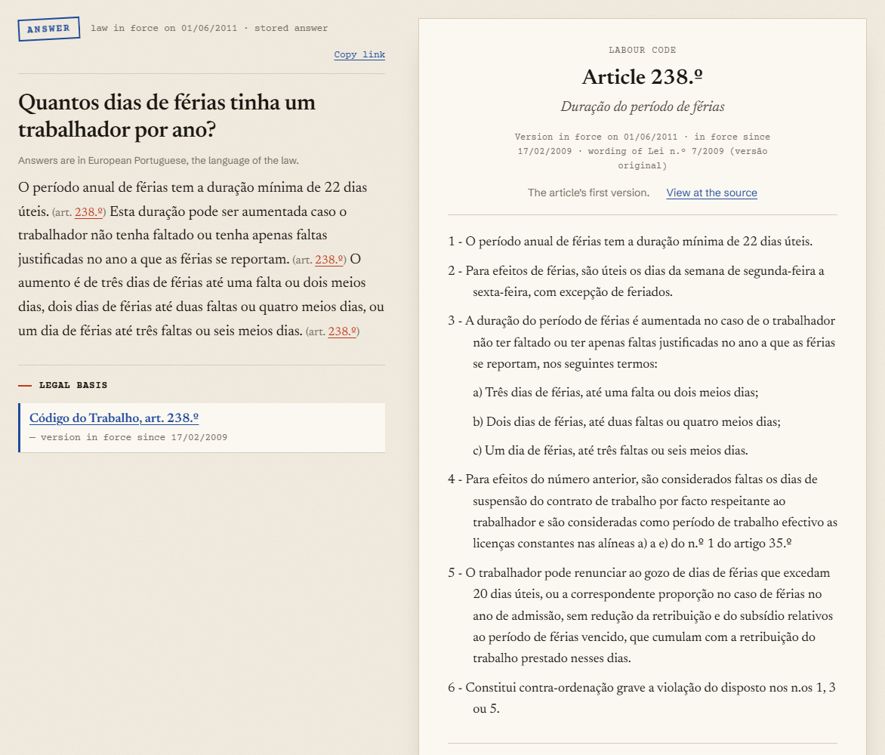
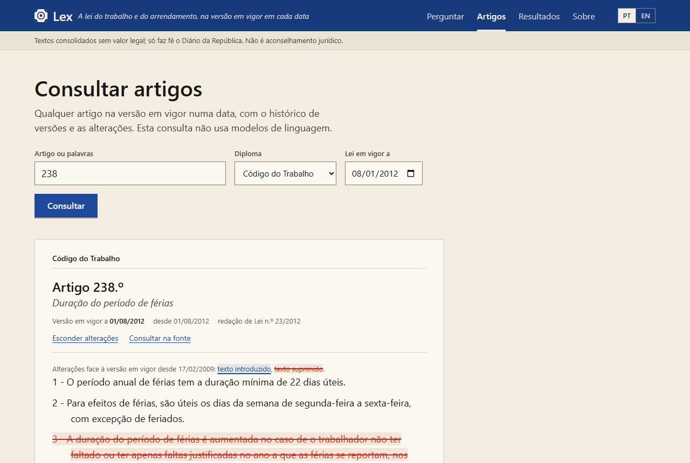
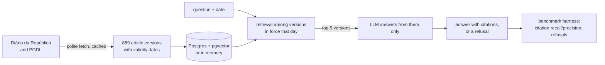

# Lex

An open benchmark for question answering over Portuguese legislation, and an open-source system
measured against it. **Live demo: [lex-beryl.vercel.app](https://lex-beryl.vercel.app)**
(Portuguese or English interface). Code: [github.com/timimata/lex](https://github.com/timimata/lex);
dataset (dev split): [huggingface.co/datasets/timimata/lex](https://huggingface.co/datasets/timimata/lex).

Portugal already has AI assistants for its law: Lia on the Diário da República, the Ministry of
Justice's Guia Prático, and commercial tools such as TogaAI and LeiGPT. As far as we could find,
none of them publishes how often it is right. Lex is about that question. It is a set of real
questions in European Portuguese, each with the date it is asked about and the articles a correct
answer must cite, plus a reference system whose every number comes from running it.



## What it does

- **The law on any date.** Every article of the Código do Trabalho is stored in every version since
  2009, with the dates each was in force, checked against the Diário da República's own history.
  Ask about 1 June 2011 and the answer uses the 2011 text.
- **Answers that cite, or refuse.** A language model answers only from the articles retrieved for
  that date, with a citation after every sentence; a citation of an article it was not given is
  dropped, a sentence left without one is dropped, and an answer left with none becomes a
  refusal.
- **What changed.** Any cited article opens on its version for the date, with its timeline and the
  changes from the previous version marked paragraph by paragraph.
- **Measured, not claimed.** A 158-question benchmark with a held-out test split, and every number
  below comes from `results/`.



## Results

On the held-out test split of benchmark v1 (88 questions never used to tune anything, 75
answerable and 13 not; `results/test/`):

| Retrieval | recall@1 | recall@10 | questions naming their article |
|---|---|---|---|
| BM25 | 0.48 | 0.75 | 0 of 8 |
| Dense (BGE-M3) | 0.59 | 0.83 | 0 of 8 |
| Dense + reranker + reference parser (reference system) | 0.76 | 0.96 | 8 of 8 |
| Gemini Embedding 2 + reference parser (the demo) | 0.71 | 0.99 | 8 of 8 |

| Answers (top 5 articles, Gemini 3.1 Flash-Lite) | Correct (LLM judge) | Citation recall | Citation precision | Answerable wrongly refused | Unanswerable refused |
|---|---|---|---|---|---|
| The demo: Gemini Embedding 2, a citation per sentence | 0.76 | 0.92 | 0.94 | 2 of 75 | 11 of 13 |
| Reference retrieval (BGE-M3 and reranker) | 0.67 | 0.89 | 0.91 | 2 of 75 | 11 of 13 |
| BGE-M3, no reranker | not judged | 0.87 | 0.91 | 2 of 75 | 12 of 13 |

**Answer correctness** comes from an LLM judge (Gemma 4 26B A4B) that compares each answer with
the question's reference answer; a refusal counts as wrong. The judge is not measured against
hand labels but on known-answer cases ([ADR 0015](docs/decisions/0015-answer-judge.md)): on dev
it accepted 54 of 54 reference answers and caught 41 of 41 altered ones, a number changed or a
yes turned into a no. That shows it catches clear errors; how it judges ambiguous answers is not
measured. The demo and the reference system differ in two ways (embeddings and answer format), so
the gap between them says which is better, not why.

The weak spot is composite questions, where the second article is often missed: for the demo,
citation recall 0.71 and 0.50 judged correct on the 16 composite test questions. Earlier runs are
kept apart: on benchmark v0 (54 test questions, with a local Gemma 4 E2B small enough for a
Raspberry Pi) in `results/test/v0/`, and on the intermediate 132-item benchmark in
`results/test/v1-132/`. Details, dev numbers and every step tried and dropped are in the
[roadmap](docs/ROADMAP.md).

## How it works



- **Retrieval** ([ADRs 0004](docs/decisions/0004-explicit-references-first.md),
  [0007](docs/decisions/0007-embedding-model.md), [0010](docs/decisions/0010-reranker.md)): an
  article the question names comes first (article numbers are not in article texts, so no
  embedding finds them); then dense retrieval, reranked in the reference system.
- **The demo** ([ADR 0014](docs/decisions/0014-serverless-demo.md)) runs on Vercel's free tier with
  no model server: Gemini Embedding 2 over the corpus held in memory (dev recall@5 0.95, above
  BGE-M3's 0.90), Gemini 3.1 Flash-Lite for answers, both on the free tier, so it cannot cost
  anything; past the day's quota it says so. It answers in 3.93 s at the median and 6.12 s at
  p95 (14 dev questions timed from Portugal after a first, possibly cold one; `results/dev/`).
- **For agents:** `python -m lex.mcp_server` serves the code as MCP tools (an article on a date,
  its versions, search, answers).
- 16 decisions are written down in [docs/decisions/](docs/decisions/), from the store to why the
  demo has no reranker.

## Layout

```
bench/              the benchmark: datasheet and data (incoming, dev, test), hand labels
docs/               roadmap, decisions (ADRs), checks, screenshots
src/lex/
  domain.py         what every part shares: Citation, Answer, System, Retriever
  bench/            item schema, split assignment, validator
  ingest/           Diário da República and PGDL -> article versions
  store/            Postgres store, and the same in memory
  retrieval/        question + date -> article versions
  generation/       article versions -> answer with citations, or refusal
  eval/             scores any System on the benchmark; judge; latency
  api/              FastAPI service and the demo's backend
  mcp_server.py     the code as MCP tools
web/                the demo's page (React, TypeScript, Vite), with an end-to-end check
vercel/, space/     deploying the demo (Vercel), or as one container (Docker)
tests/
```

## Setup

Needs Python 3.12+.

```bash
python -m venv .venv
.venv\Scripts\activate           # source .venv/bin/activate on macOS/Linux
pip install -e ".[dev]"
python -m lex.bench validate
```

To fetch the Código do Trabalho (about 400 polite requests the first time, none after) and load
it into the store (Postgres with pg_search and pgvector, [ADR 0006](docs/decisions/0006-store.md)):

```bash
pip install -e ".[ingest]"
playwright install chromium
python -m lex.ingest ct                        # add --offline to rebuild from the cache
docker compose up -d --wait
python -m lex.store load
python -m lex.store show 238 --as-of 2011-06-01
```

To answer and score (Gemini by default, with `LLM_API_KEY` in `.env`; `.env.example` shows how to
use a local llama.cpp or LM Studio server instead):

```bash
pip install -e ".[dense,llm,api]"
python -m lex.eval answers                      # the reference system on dev
python -m lex.eval answers --retriever dense-gemini+refs   # the demo's system, no Postgres
python -m lex.api --demo                        # the demo on 127.0.0.1:8000
```

## Licence

The code is MIT-licensed ([LICENSE](LICENSE)); the benchmark is CC BY 4.0
([bench/LICENSE.md](bench/LICENSE.md)). The test split's items stay private so that its scores
keep their meaning; its results are published here and on the leaderboard
([ADR 0016](docs/decisions/0016-licences-and-hidden-test.md)).

## Not legal advice

Consolidated texts published by the Diário da República have no legal value, and nothing Lex
produces is legal advice.
